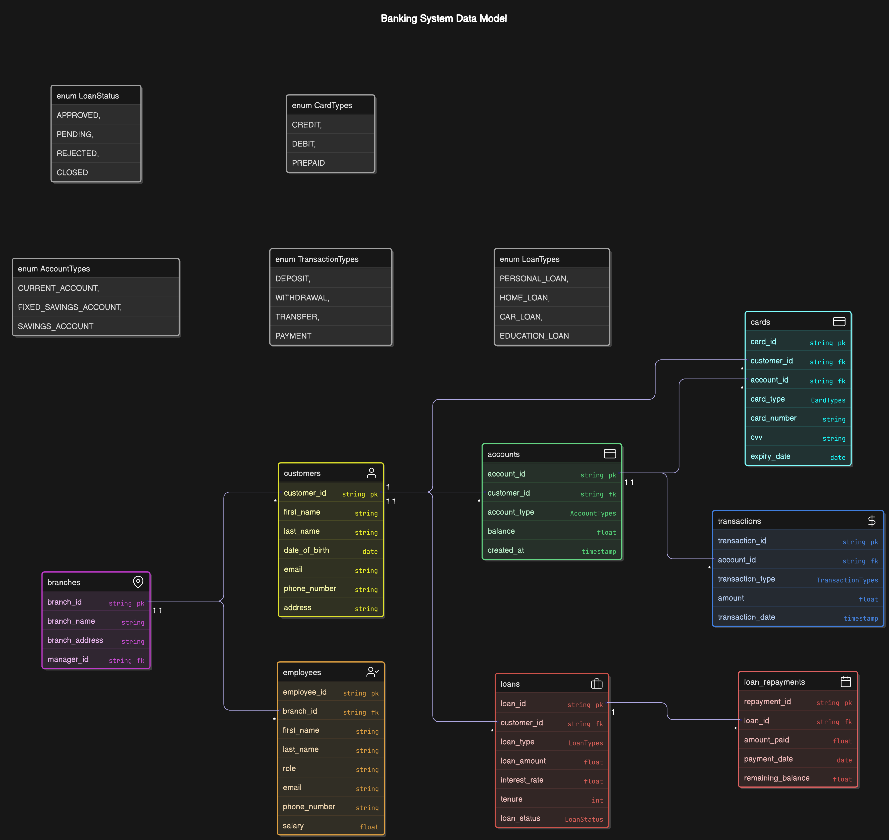

# Banking System Data Model

## Overview

The **Banking System Data Model** includes various entities to manage a bank's operations, including **Customers**, **Accounts**, **Transactions**, **Loans**, **Branches**, **Employees**, **Cards**, and **Loan Repayments**. The system is designed to track financial operations, customer data, and employee roles within a bank.

---

## ER Diagram

## Entities

### **Customers**

Represents the customers who use the bank's services.

- `customer_id` (PK): Unique identifier for the customer.
- `first_name`: Customer's first name.
- `last_name`: Customer's last name.
- `date_of_birth`: Customer's date of birth.
- `email`: Customer's email address.
- `phone_number`: Customer's phone number.
- `address`: Customer's residential address.

---

### **Accounts**

Represents the accounts held by customers.

- `account_id` (PK): Unique identifier for the account.
- `customer_id` (FK): Foreign key referencing `customers.customer_id`.
- `account_type`: Type of the account (e.g., savings, checking).
- `balance`: Current balance in the account.
- `created_at`: Timestamp of account creation.

---

### **Transactions**

Represents the transactions that occur in customer accounts.

- `transaction_id` (PK): Unique identifier for the transaction.
- `account_id` (FK): Foreign key referencing `accounts.account_id`.
- `transaction_type`: Type of transaction (deposit, withdrawal, etc.).
- `amount`: Amount involved in the transaction.
- `transaction_date`: Timestamp of the transaction.

---

### **Loans**

Represents the loans provided to customers.

- `loan_id` (PK): Unique identifier for the loan.
- `customer_id` (FK): Foreign key referencing `customers.customer_id`.
- `loan_type`: Type of loan (e.g., personal loan, home loan).
- `loan_amount`: Amount of the loan.
- `interest_rate`: Interest rate on the loan.
- `tenure`: Loan tenure in months.
- `loan_status`: Status of the loan (e.g., approved, pending).

---

### **Branches**

Represents the branches of the bank.

- `branch_id` (PK): Unique identifier for the branch.
- `branch_name`: Name of the branch.
- `branch_address`: Address of the branch.
- `manager_id` (FK): Foreign key referencing `employees.employee_id`.

---

### **Employees**

Represents the employees working at the bank branches.

- `employee_id` (PK): Unique identifier for the employee.
- `branch_id` (FK): Foreign key referencing `branches.branch_id`.
- `first_name`: Employee's first name.
- `last_name`: Employee's last name.
- `role`: Role of the employee (e.g., manager, clerk).
- `email`: Employee's email address.
- `phone_number`: Employee's phone number.
- `salary`: Employee's salary.

---

### **Cards**

Represents the cards issued to customers for their accounts.

- `card_id` (PK): Unique identifier for the card.
- `customer_id` (FK): Foreign key referencing `customers.customer_id`.
- `account_id` (FK): Foreign key referencing `accounts.account_id`.
- `card_type`: Type of card (credit, debit).
- `card_number`: Card number.
- `cvv`: CVV number on the card.
- `expiry_date`: Expiry date of the card.

---

### **Loan Repayments**

Represents the repayments made on loans by customers.

- `repayment_id` (PK): Unique identifier for the repayment.
- `loan_id` (FK): Foreign key referencing `loans.loan_id`.
- `amount_paid`: Amount paid for the repayment.
- `payment_date`: Date of repayment.
- `remaining_balance`: Remaining balance of the loan.

---

## Enums

The following **enums** are used to restrict the values for certain fields in the database.

### **AccountTypes**

Defines the types of accounts customers can hold.

- `CURRENT_ACCOUNT`
- `FIXED_SAVINGS_ACCOUNT`
- `SAVINGS_ACCOUNT`

### **TransactionTypes**

Defines the types of transactions.

- `DEPOSIT`
- `WITHDRAWAL`
- `TRANSFER`
- `PAYMENT`

### **LoanTypes**

Defines the types of loans.

- `PERSONAL_LOAN`
- `HOME_LOAN`
- `CAR_LOAN`
- `EDUCATION_LOAN`

### **LoanStatus**

Defines the status of a loan.

- `APPROVED`
- `PENDING`
- `REJECTED`
- `CLOSED`

### **CardTypes**

Defines the types of cards issued by the bank.

- `CREDIT`
- `DEBIT`
- `PREPAID`

---

## Relationships

The relationships between the tables are defined as follows:

1. **Customers ↔ Accounts**: One customer can have multiple accounts.

   - `customers.customer_id < accounts.customer_id`

2. **Accounts ↔ Transactions**: Each account can have multiple transactions.

   - `accounts.account_id < transactions.account_id`

3. **Customers ↔ Loans**: One customer can have multiple loans.

   - `customers.customer_id < loans.customer_id`

4. **Loans ↔ Loan Repayments**: Each loan can have multiple repayments.

   - `loans.loan_id < loan_repayments.loan_id`

5. **Branches ↔ Employees**: Each branch can have multiple employees.

   - `branches.branch_id < employees.branch_id`

6. **Employees ↔ Branches**: Each employee works at a specific branch.

   - `employees.branch_id < branches.branch_id`

7. **Branches ↔ Customers**: Customers may have a relationship with a branch.

   - `branches.branch_id < customers.customer_id`

8. **Customers ↔ Cards**: Each customer can have multiple cards.

   - `customers.customer_id < cards.customer_id`

9. **Accounts ↔ Cards**: Cards are associated with a particular account.
   - `accounts.account_id < cards.account_id`

---

## Usage

This data model is designed to track the following operations in a banking system:

- **Customer account management**: Create, update, and track customer details and accounts.
- **Transaction processing**: Handle deposits, withdrawals, and transfers between accounts.
- **Loan management**: Create and track loan applications, disbursements, and repayments.
- **Card issuance**: Track the issuance of credit, debit, and prepaid cards to customers.
- **Employee management**: Manage employees working across bank branches.

---
